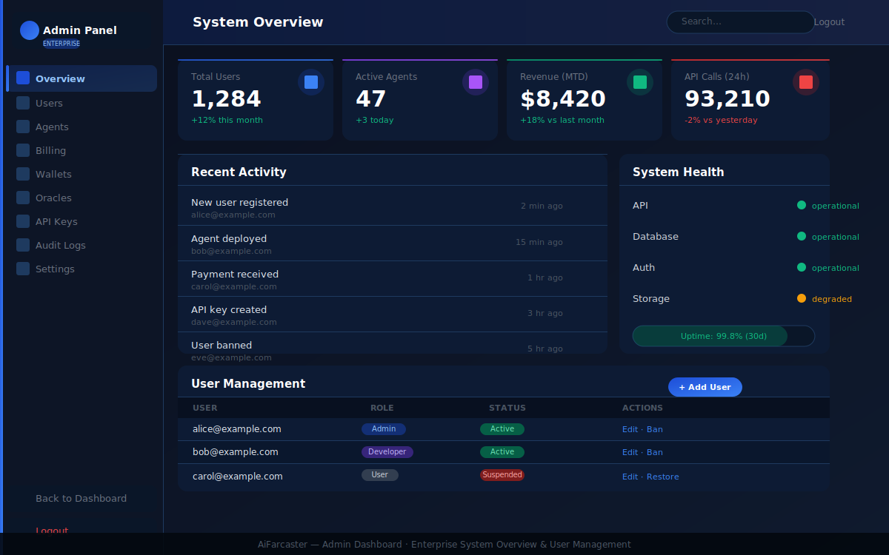

# Admin Guide

Complete guide for administrators managing the AiFarcaster enterprise platform.

## Table of Contents

1. [Admin Dashboard](#admin-dashboard)
2. [User Management](#user-management)
3. [Role-Based Access Control (RBAC)](#role-based-access-control-rbac)
4. [System Health Monitoring](#system-health-monitoring)
5. [API Key Management](#api-key-management)
6. [Billing & Payments](#billing--payments)
7. [Audit Logs](#audit-logs)
8. [Agent Management](#agent-management)
9. [Oracle Management](#oracle-management)
10. [Security Settings](#security-settings)
11. [Configuration](#configuration)

---

## Admin Dashboard

The Admin Dashboard provides a full enterprise-grade system overview with real-time metrics, user management, and system health monitoring.

### Dashboard Screenshot


*Enterprise admin dashboard — system overview, user management, and health monitoring*

### Key Metrics

The admin overview displays four key performance indicators:

| Metric | Description |
|--------|-------------|
| **Total Users** | Total registered users with month-over-month change |
| **Active Agents** | Number of currently running AI agents |
| **Revenue (MTD)** | Month-to-date revenue with comparison |
| **API Calls (24h)** | Total API calls in the past 24 hours |

### Accessing the Admin Panel

1. Navigate to `/admin/login`
2. Sign in with your admin credentials (Supabase email/password)
3. The dashboard loads at `/admin`

> **Security Note:** Admin access is protected by Supabase authentication. Only users with admin-level credentials can access the `/admin` routes.

---

## User Management

The **Users** section (`/admin/users`) allows full lifecycle management of platform users.

### Viewing Users

- Browse all registered users in a searchable, paginated table
- See each user's role, status, and registration date
- Filter by role: Admin, Developer, User, Auditor

### User Actions

| Action | Description |
|--------|-------------|
| **Edit** | Modify user role, permissions, or profile |
| **Ban/Suspend** | Temporarily or permanently restrict access |
| **Restore** | Reinstate a suspended user |
| **Delete** | Permanently remove a user (irreversible) |

### Adding a New User

1. Click **+ Add User** in the top-right of the Users table
2. Enter the user's email address
3. Set their initial role
4. Click **Create User** — an invitation email is sent via Supabase

---

## Role-Based Access Control (RBAC)

AiFarcaster uses four roles with escalating permissions:

| Role | Access Level | Description |
|------|-------------|-------------|
| **Admin** | Full access | Complete system control, user management, billing |
| **Developer** | Extended | API access, environment management, deployment tools |
| **User** | Standard | Dashboard, frames, projects, templates |
| **Auditor** | Read-only | View logs, metrics, and reports; no write access |

### Assigning Roles

1. Navigate to **Users** → find the target user
2. Click **Edit**
3. Select the new role from the dropdown
4. Save — changes take effect immediately

### Permission Matrix

| Feature | Admin | Developer | User | Auditor |
|---------|-------|-----------|------|---------|
| Manage users | ✅ | ❌ | ❌ | ❌ |
| View audit logs | ✅ | ❌ | ❌ | ✅ |
| API key management | ✅ | ✅ | ❌ | ❌ |
| Create frames | ✅ | ✅ | ✅ | ❌ |
| View dashboards | ✅ | ✅ | ✅ | ✅ |
| Billing management | ✅ | ❌ | ❌ | ❌ |
| System configuration | ✅ | ❌ | ❌ | ❌ |

---

## System Health Monitoring

The **System Health** panel (visible on the admin overview) shows real-time status of all platform services.

### Service Status Indicators

| Color | Status | Meaning |
|-------|--------|---------|
| 🟢 Green | Operational | Service running normally |
| 🟡 Yellow | Degraded | Service running with reduced capacity |
| 🔴 Red | Down | Service unavailable |

### Monitored Services

- **API** — Next.js API routes and Farcaster hub connection
- **Database** — Supabase PostgreSQL connection
- **Auth** — Supabase authentication service
- **Storage** — Supabase file storage

### Health Check Endpoint

```
GET /api/health
```

Returns JSON with service statuses and uptime metrics.

---

## API Key Management

The **API Keys** section (`/admin/api-keys`) manages keys for external integrations.

### Creating an API Key

1. Navigate to **Admin → API Keys**
2. Click **Generate New Key**
3. Enter a descriptive name and set permissions scope
4. Copy the key immediately — it will not be shown again
5. Store securely in your application's environment variables

### Key Permissions

- `read` — Read-only access to data endpoints
- `write` — Create and update operations
- `admin` — Full API access including user management

### Revoking Keys

1. Find the key in the list
2. Click **Revoke**
3. Confirm the action — this cannot be undone

---

## Billing & Payments

The **Billing** section (`/admin/billing`) manages subscriptions and payment records.

### Supported Payment Methods

- **Crypto (Base mainnet)** — ETH, USDC, and platform tokens
- **Stripe** — Credit/debit card processing

### Viewing Payment History

- Filter by date range, user, or payment method
- Export reports as CSV

### Subscription Tiers

| Tier | Monthly Price | Frames | Templates | API Calls |
|------|--------------|--------|-----------|-----------|
| Free | $0 | 3 | 20 (basic) | 1,000 |
| Pro | $29 | Unlimited | 100+ | 50,000 |
| Enterprise | Custom | Unlimited | All | Unlimited |

---

## Audit Logs

The **Audit Logs** section (`/admin/logs`) provides a complete, tamper-evident record of all platform actions.

### Log Categories

| Category | Events |
|----------|--------|
| **Auth** | Login, logout, password changes, failed attempts |
| **Users** | Creation, modification, deletion, role changes |
| **Payments** | Transactions, refunds, subscription changes |
| **API** | Key creation/revocation, rate limit events |
| **System** | Config changes, deployments, health events |

### Searching Logs

- Full-text search on event description
- Filter by user, category, date range
- Export filtered results to CSV or JSON

---

## Agent Management

The **Agents** section (`/admin/agents`) controls AI agent instances.

### Agent Operations

- **Start/Stop** individual agents
- **View** agent logs and output
- **Configure** agent parameters (model, temperature, max tokens)
- **Monitor** token usage and costs

---

## Oracle Management

The **Oracles** section (`/admin/oracles`) manages data feed connections for on-chain integrations.

### Supported Oracle Networks

- Chainlink (price feeds)
- Custom HTTP oracles
- Webhook-based data sources

---

## Security Settings

### Password Policy

The admin can enforce platform-wide password requirements:
- Minimum length (default: 12 characters)
- Require uppercase, lowercase, numbers, symbols
- Password expiry (0 = never)
- Prevent password reuse (last N passwords)

### Session Management

- Session timeout (default: 24 hours)
- Force logout all sessions for a user
- View active sessions per user

### Rate Limiting

Configure request limits in the environment:

```env
RATE_LIMIT_REQUESTS=100
RATE_LIMIT_WINDOW_MS=60000
```

---

## Configuration

The **Settings** section (`/admin/settings`) provides system-wide configuration.

### Environment Variables

Critical variables required for admin features:

```env
# Authentication (required)
NEXT_PUBLIC_SUPABASE_URL=https://your-project.supabase.co
NEXT_PUBLIC_SUPABASE_ANON_KEY=your-anon-key
SUPABASE_SERVICE_ROLE_KEY=your-service-role-key

# Payments
STRIPE_SECRET_KEY=sk_...
STRIPE_WEBHOOK_SECRET=whsec_...

# Farcaster
FARCASTER_HUB_URL=nemes.farcaster.xyz:2283
```

See [ENVIRONMENT.md](./ENVIRONMENT.md) for the complete list.

### Changing Admin Password

1. Navigate to **Admin → Settings → Change Password**
2. Enter your current password
3. Enter and confirm your new password
4. Click **Update Password**

---

## Troubleshooting

### Cannot Access Admin Panel

1. Verify you have admin-level Supabase credentials
2. Check that `NEXT_PUBLIC_SUPABASE_URL` and `NEXT_PUBLIC_SUPABASE_ANON_KEY` are set
3. Check the browser console for authentication errors

### Users Not Loading

1. Verify `SUPABASE_SERVICE_ROLE_KEY` is set (required for admin user queries)
2. Check that the `users` table exists in your Supabase project
3. Run pending migrations if the schema is missing

### System Health Shows Degraded

1. Check Supabase project status at [status.supabase.com](https://status.supabase.com)
2. Verify your Supabase project quota has not been exceeded
3. Check the deployment logs for recent errors

---

*For general platform usage, see the [User Guide](./USER_GUIDE.md). For API integration, see [API.md](./API.md).*
